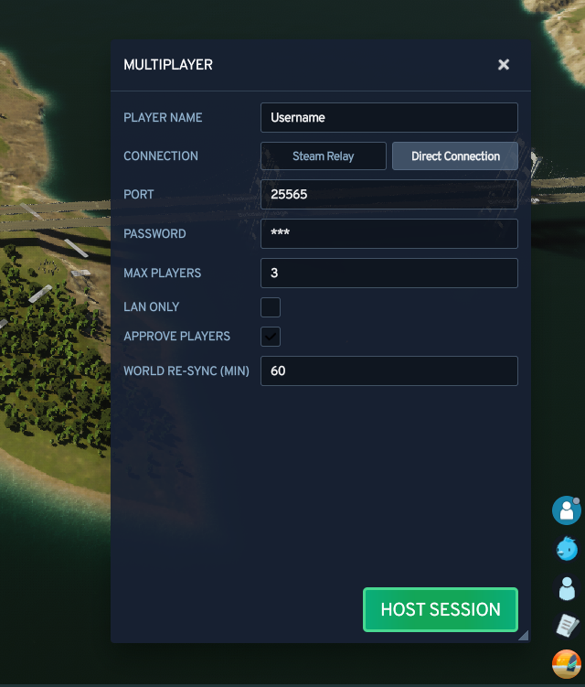
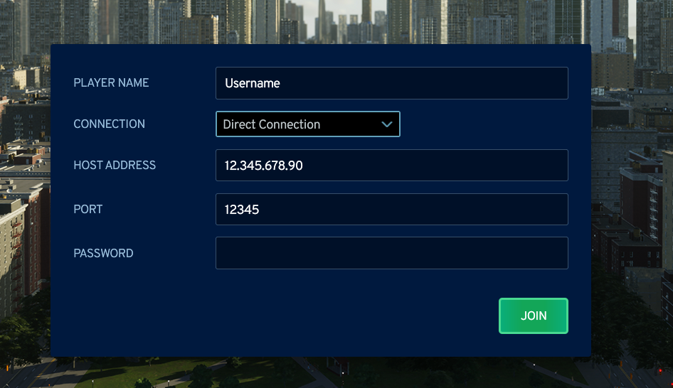

# Direct connection

Players connect straight to the host's address and TCP port. This works on any copy of the
game, including Xbox App, Microsoft Store and Game Pass, but the host's port has to be
reachable.

The default port is TCP `25001`. The host, every joining player, the firewall rule and the
router rule all have to use the same port.

## Hosting

1. Open Multiplayer and click Host Game.
2. Set the connection type to Direct Connection.
3. Load or create your world as usual. The session starts once the city has loaded.
4. Share your address and port with the other players.

At the top of this screen you pick the connection type. At the bottom you choose whether to
load an existing world or create a new one.

Which address you share depends on where the other players are:

| Players | Address to share |
| --- | --- |
| Same network (LAN) | Your local IP address, shown in the log when hosting starts |
| Over the internet | Your public IP, from [api.ipify.org](https://api.ipify.org/) |

Session settings live in the multiplayer panel while you play, and in the mod options
before you start: port, password, player limit, LAN Only, player approval and the world
re-sync interval.

## Joining

1. Open Multiplayer and click Join Game.
2. Set the connection type to Direct Connection.
3. Enter the host's address and port, your player name, and the password if there is one.
4. Click Join and wait while the host's city downloads.

!!! warning "Set a password"

    A host reachable from the internet accepts anyone who finds the port, and everyone who
    joins downloads a copy of the city. Set a server password, or use
    [Steam Relay](steam-relay.md), or switch LAN Only on to accept local players only.

## Playing on the same network

Nothing has to be forwarded. Joining players use the host's local IP address and the same
port. The host can switch LAN Only on to refuse everything that is not from the local
network.
