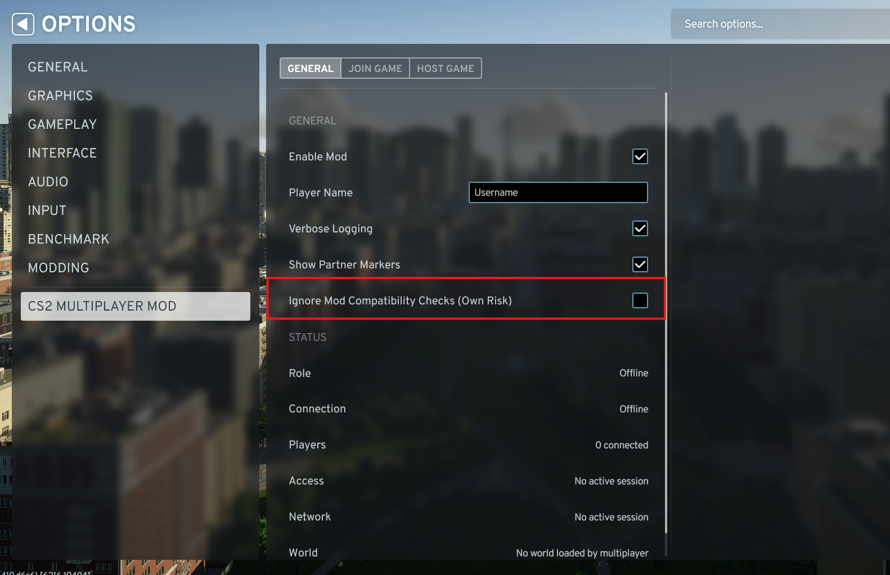

# Mods and compatibility

## Official mod support

No mods are officially supported. Playing with mods is experimental. Any mod that adds
gameplay functionality will not work, and you may get desyncs, crashes or a corrupted city.

Proper compatibility with some mods is planned for later versions. It needs work on both
sides: the multiplayer mod and the other mod have to cooperate to expose what changed.

---

## Other mods are blocked

Hosting and joining are blocked while any other mod is active, and a host rejects players
running a different CS2 Multiplayer Mod build. Nothing in the synchronization layer accounts
for a third party changing prefabs, tools or the simulation, so one extra mod on one machine
is enough to desync the session or crash the other player.

The check reads your active Paradox Mods playset. That includes asset-only mods such as
maps, prop packs and prefab packs, which load no code at all. Mods in your other playsets
are not enabled for this run and are ignored.

| Banner | Meaning |
| --- | --- |
| Other Mods Enabled | Host and Join are blocked; the listed mods have to be disabled |
| Other Mods Enabled, still loaded | Already disabled in the playset, but still in memory - restart the game once |
| Compatibility Check Ignored | Other mods are active and the own-risk override is on |

To clear the block:

1. Disable every mod except CS2 Multiplayer Mod in your active playset. A playset that
   contains only this mod is the safest setup.
2. Go back to the game and wait a few seconds for the banner to clear.
3. If the banner says the mods are still loaded, restart the game.

---

## Turning the check off

Options ▸ CS2 Multiplayer Mod ▸ General ▸ Ignore Mod Compatibility Checks (Own Risk).
Change it while offline, before hosting or joining.

With it on, other active mods no longer block hosting or joining on your machine, and a
host also admits players on a different CS2 Multiplayer Mod build as long as the network
protocol matches.

It does not bypass:

- the network protocol check, because different builds can encode network data differently,
- the Cities: Skylines II version check, or
- the DLC check.

It also does not make another mod multiplayer-aware. Back up the city, use the same playset
on every computer where possible, and expect desyncs, missing prefabs, broken cities or
crashes. The host decides whether different multiplayer-mod builds are admitted; each
player decides whether their own extra mods are allowed locally.

---

## Mod compatibility list

Some display-only or UI-only mods may work. This list is not comprehensive - contributions
and testing are welcome.

Updated `2026-08-06` for version `v0.1.3`.
[Current mod version](https://github.com/Rollocraft/CS2MultiplayerMod/blob/master/CS2MultiplayerMod/Properties/PublishConfiguration.xml#L31).

### Possibly compatible

- Anarchy-style mods that do the same thing as the developer options

### Incompatible

Every mod that adds functionality, for example:

- Road Builder
- Traffic mods

---

[Back to troubleshooting.](troubleshooting.md)
