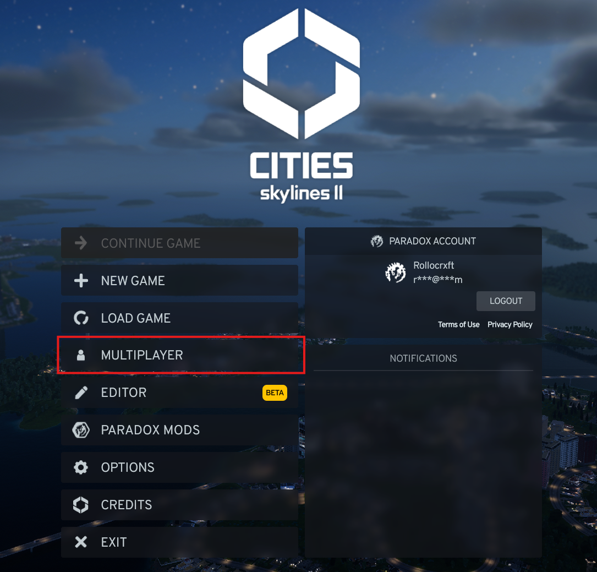
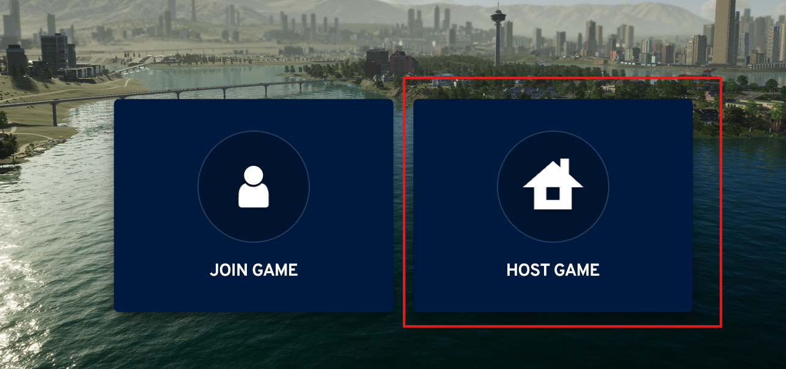
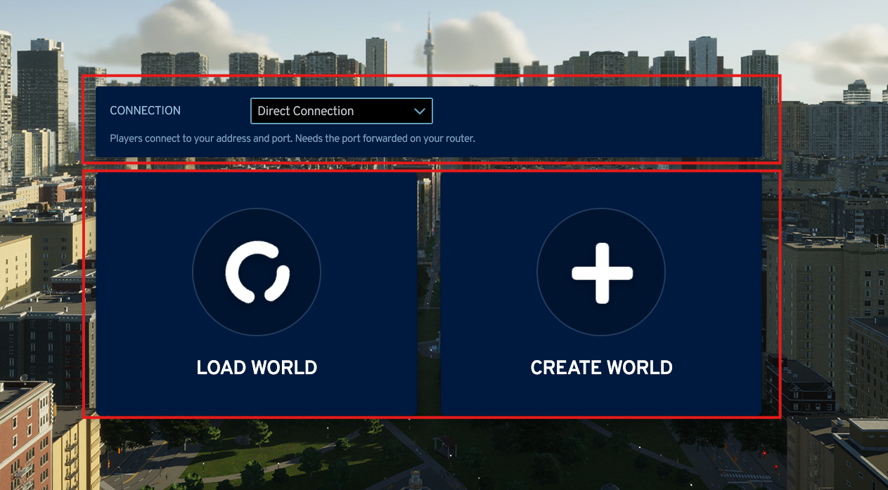
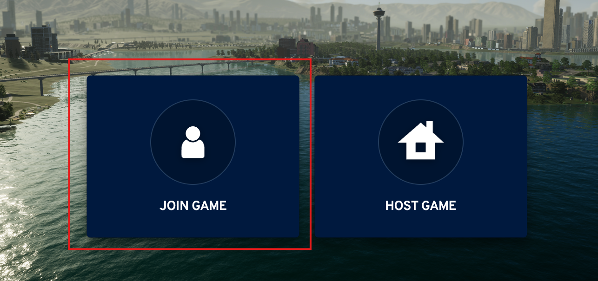
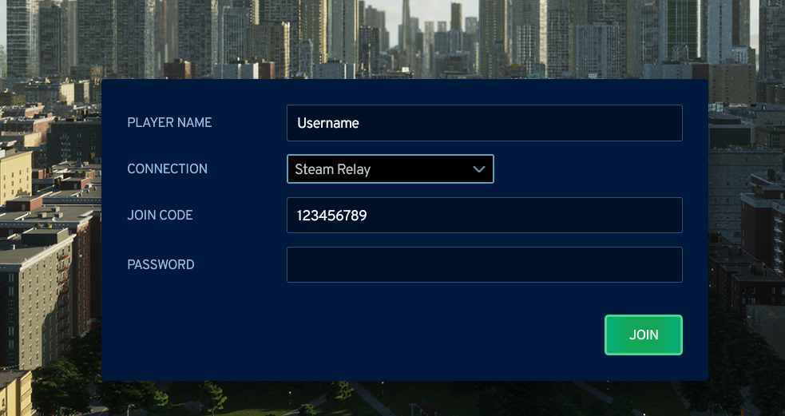

# Steam Relay

## Requirements

- The Steam copy of Cities: Skylines II, launched through Steam, with Steam online.
- Both players choose Steam Relay. The mode has to match.

Xbox App, Microsoft Store and Game Pass copies cannot use the relay. Those players use a
[direct connection](direct-connection.md) instead.

## Hosting with a relay

1. Open Multiplayer and click Host Game.

2. Set the connection type to Steam Relay.
3. Your join code appears there. Click it to select it, then press <kbd>Ctrl</kbd>+<kbd>C</kbd>.

4. Load or create your world as usual. The session starts once the city has loaded.
5. Send the code to your friends.

## Joining with a code

1. Open Multiplayer and click Join Game.

2. Set the connection type to Steam Relay.
3. Paste the code into the join code field, enter your player name and the password if the
   host set one.

4. Click Join and wait while the host's city downloads.

## When the code is unavailable

If the host screen shows "Unavailable - start the game through Steam", one of these is
true:

- The game was not launched through Steam, or Steam is offline. Close the game, start
  Steam, and launch the game from there.
- The installation is not the Steam version. Use a [direct connection](direct-connection.md).

If the relay refuses to start or drops repeatedly, restart Steam and the game. If it keeps
failing, both players can switch to a direct connection.

More relay messages are listed under
[Steam Relay is unavailable or the join code is invalid](errors-and-warnings.md#steam-relay-is-unavailable-or-the-join-code-is-invalid).
